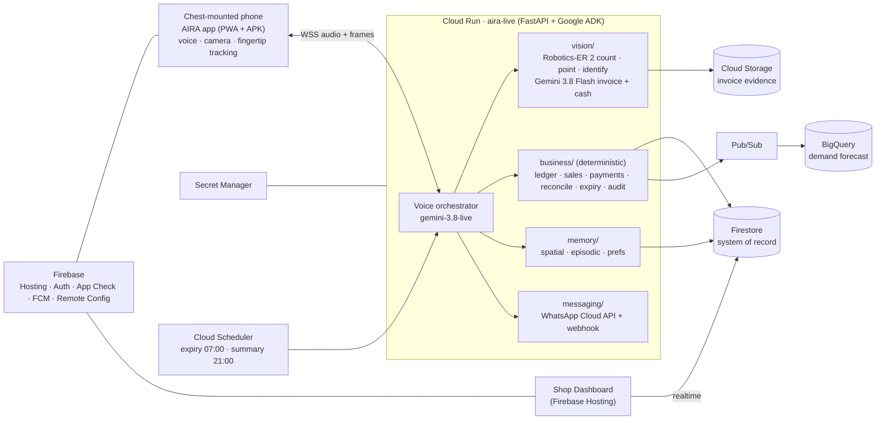
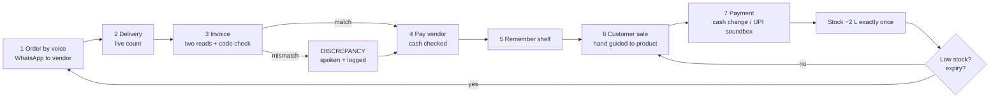

# AIRA Submission Implementation Plan (Saravana · 03)

> **For agentic workers:** REQUIRED SUB-SKILL: Use superpowers:subagent-driven-development (recommended) or superpowers:executing-plans to implement this plan task-by-task. Steps use checkbox (`- [ ]`) syntax for tracking.

**Goal:** Produce every Hack2skill submission item for AIRA, and verify each one mechanically before it is uploaded. That covers the user-validation evidence, the ≤1024-character description, the 16-slide deck PDF (<5 MB), the 4-minute demo video, the cost and benchmark numbers, and the freeze-and-submit runbook. Submission is due by **2026-10-18 20:00 IST**.

**Architecture:**

- A small stdlib-only Python toolkit in `scripts/` checks the submission:
  - `check_submission.py` checks description, links, PDF and video.
  - `cost_per_sale.py` gives ₹ per sale and per shop-month.
  - `bench_table.py` turns benchmark CSVs into the deck table and a merged CSV for BigQuery.
- Every human-written artefact lives in `submission/`, under version control: description, deck text, diagrams, user-study pack, video checklist, support email, freeze runbook.
- pytest guards the toolkit and the final texts, so a last-minute edit cannot silently break a rule.

**Tech Stack:** Python 3.12 (stdlib only), pytest via `uv run --with pytest`, ffprobe (from ffmpeg), the `bq` CLI, mermaid-cli (`npx -y @mermaid-js/mermaid-cli`), Google Slides (the official template), YouTube.

**Spec:** `docs/superpowers/specs/2026-10-10-aira-design.md` (§2 loop, §4 architecture, §7 benchmarks, §8 demo and submission, §9 roadmap). Interfaces: `docs/superpowers/plans/2026-10-10-00-interfaces.md`.

## Global Constraints

**Form and file rules:**
- Hack2skill form fields, from `docs/hackathon/official/participation/dashboard-submission.md`:
  - Challenge: select **"Sustainability & Social Impact"**
  - Prototype link on GCP / Cloud Run
  - Deck PDF, **< 5 MB**
  - Public GitHub link starting with `https://`: **https://github.com/Saravana-Rajan/AIRA**
  - Demo video link
  - Description, **≤ 1024 characters**
- The description **must name Firebase, Firestore, Cloud Run and Gemini**, and how each is used.
- The deck uses the prescribed 16-slide template (https://docs.google.com/presentation/d/13rg7vW43mEH6DkpuusAE6fdoEylSFz8waNpE4RLzoUg), keeps all **16 slides**, and is exported to PDF.

**Video length:**
- The team decision is **≤ 4:00, target 3:50**. The sources conflict:
  - dashboard narrative: "3 to 4 minute"
  - field label: "up to 3 minutes"
  - official terms: "strictly below three minutes", and the terms take precedence over inconsistent material
- So Task 7 **emails support@hack2skill.com on Oct 11**. **If there is no written approval for 4 minutes by Oct 16 18:00 IST, submit the ≤ 2:55 cut** (Task 7, Step 4).

**Product and data:**
- Product name **AIRA**. Demo shop **Murugan Dairy** (Aavin milk, Sakthi curd, Arun ice cream).
- Never claim counterfeit-note detection or real bank UPI integration. UPI is confirmed via the payment **soundbox** announcement.
- Only cite numbers we have sources for:
  - ~12M kirana stores (Britannia A-Eye press coverage, 2025)
  - ~9.2M blind people in India (IAPB estimate)
  - NHFDC self-employment loans for people with 40%+ disability
  - Everything else must be **measured** (`bench/results/*.csv`) or computed by `scripts/cost_per_sale.py`.
- Never commit secrets, the user's personal email or phone, or participants' faces without consent.

**Benchmark CSV format** (cross-team; every owner's scorer writes it): header exactly `metric,value,unit,device,build,ts`.
- `unit` is `ms` for one row per trial (reported as p50/p95), or `%`, `s` or `₹` for one row per run (reported as a mean).
- `ts` is ISO-8601 UTC.

**Dates (IST):**

| Date | What |
|---|---|
| Oct 11 | Outreach + support email |
| Oct 15 | User study + benchmarks |
| Oct 16 | Video shoot |
| Oct 17 | Deck, description, edit |
| Oct 18 | 18:00 deploy freeze; submit by 20:00 |

## Review Focus

1. **Character counting differs between Python and the browser.** The form counts UTF-16 code units, so an emoji counts as 2. `js_length()` mirrors the browser, and the final description is tested with it (Task 1 `test_js_length_counts_emoji_as_two`, Task 2 `test_final_description_passes_checks`).
2. **A video link that "works" only while logged in.** Drive and YouTube private links return HTTP 200 but redirect to a login page for judges. The link check fails on login redirects (Task 1 `test_links_ok_and_failures`).
3. **A PDF just over the limit after adding screenshots.** The checker uses a strict `< 5,000,000 bytes` and validates the `%PDF-` header (Task 1 `test_pdf_size_boundary`, `test_pdf_header`).
4. **A video that is 240.4 s, or over 3:00 without written approval.** It fails above `--max-video` and warns above 179 s (Task 1 `test_video_limits`). Task 7's decision rule picks the cut.
5. **The deck loses a rubric keyword or a slide during editing.** The AI pre-screen reads the PDF text. Tests require all 16 slides and every rubric phrase (Task 6 `test_deck_has_16_slides`, `test_deck_covers_rubric_keywords`).

---

## Schedule

| Task | What | Due (IST) |
|---|---|---|
| 1 | Submission checker | Oct 15 |
| 2 | Final description | Oct 17 |
| 3 | Cost estimate | Oct 15 |
| 4 | Benchmark table + BigQuery | Oct 15 (after scorers run) |
| 5 | User-validation pack | **Oct 11 (send outreach)**; study Oct 15 |
| 6 | Deck content + PDF | Oct 17 |
| 7 | Video checklist + support email | **Oct 11 (email)**; shoot Oct 16; edit Oct 17 |
| 8 | Freeze + submit | Oct 18 |

## File Structure

```
scripts/
  check_submission.py          # description / links / PDF / video checks (stdlib)
  cost_per_sale.py             # ₹ per sale, per delivery, per shop-month
  bench_table.py               # bench/results/*.csv → deck table + merged CSV
  bench_summary.sql            # BigQuery version of the benchmark table
  tests/conftest.py
  tests/test_check_submission.py
  tests/test_description.py
  tests/test_cost_per_sale.py
  tests/test_bench_table.py
  tests/test_deck_content.py
submission/
  description.txt              # final ≤1024-char description
  links.template.json          # envsubst → links.json (links.json is committed after Task 8)
  deck-content.md              # text for all 16 slides
  diagrams/architecture.mmd  diagrams/process-flow.mmd
  user-study/outreach.md  user-study/protocol.md  user-study/consent-form.md  user-study/data-sheet.csv
  video-checklist.md  support-email.md  freeze-runbook.md
```

---

### Task 1: Submission checker (`scripts/check_submission.py`)

**Files:**
- Create: `scripts/check_submission.py`, `scripts/tests/conftest.py`
- Test: `scripts/tests/test_check_submission.py`

**Interfaces:**
- Consumes: nothing (stdlib only; `ffprobe` on PATH for the video check).
- Produces:
  - `js_length(text: str) -> int`
  - `check_description(text: str) -> list[str]`
  - `check_links(links: dict[str, str], fetch=fetch_status) -> list[str]`
  - `fetch_status(url: str, timeout: float = 15.0) -> tuple[int, str]`
  - `check_pdf(path: Path) -> list[str]`
  - `check_video(path: Path, max_s: float, strict_warn_s: float, run=subprocess.run) -> tuple[list[str], list[str]]`
  - `main(argv: list[str] | None = None) -> int` (0 = pass, 1 = fail)
  - Constants `MAX_DESCRIPTION = 1024`, `MAX_PDF_BYTES = 5_000_000`

- [ ] **Step 1: Write `scripts/tests/conftest.py`**

```python
import sys
from pathlib import Path

sys.path.insert(0, str(Path(__file__).resolve().parents[1]))
```

- [ ] **Step 2: Write the failing tests `scripts/tests/test_check_submission.py`**

```python
import subprocess

import check_submission as cs

GOOD = "AIRA runs on Gemini, Cloud Run, Firestore and Firebase."


def test_description_ok():
    assert cs.check_description(GOOD) == []


def test_description_too_long():
    errs = cs.check_description(GOOD + " x" * 600)
    assert any("max 1024" in e for e in errs)


def test_description_missing_term():
    errs = cs.check_description("AIRA uses Gemini on Cloud Run with Firebase.")
    assert errs == ["description must mention Firestore"]


def test_cloud_run_across_line_break():
    assert cs.check_description("Gemini, Firebase, Firestore and Cloud\nRun.") == []


def test_js_length_counts_emoji_as_two():
    assert cs.js_length("₹") == 1
    assert cs.js_length("🙂") == 2


def test_description_rejects_todo():
    assert any("TODO" in e for e in cs.check_description(GOOD + " TODO"))


def test_links_ok_and_failures():
    responses = {
        "https://ok.example": (200, "https://ok.example"),
        "https://down.example": (503, "https://down.example"),
        "https://drive.example/v": (200, "https://accounts.google.com/ServiceLogin?continue=x"),
    }
    errs = cs.check_links(
        {
            "app": "https://ok.example",
            "api": "https://down.example",
            "video": "https://drive.example/v",
            "repo": "github.com/x",
        },
        fetch=lambda u: responses[u],
    )
    assert len(errs) == 3
    assert any("HTTP 503" in e for e in errs)
    assert any("login page" in e for e in errs)
    assert any("must start with https://" in e for e in errs)


def test_pdf_size_boundary(tmp_path):
    small = tmp_path / "ok.pdf"
    small.write_bytes(b"%PDF-1.7\n" + b"0" * 100)
    assert cs.check_pdf(small) == []
    big = tmp_path / "big.pdf"
    big.write_bytes(b"%PDF-1.7\n" + b"0" * cs.MAX_PDF_BYTES)
    assert any("must be under" in e for e in cs.check_pdf(big))


def test_pdf_header(tmp_path):
    f = tmp_path / "x.pdf"
    f.write_bytes(b"PK\x03\x04 not a pdf")
    assert cs.check_pdf(f) == ["file is not a PDF (missing %PDF- header)"]


class FakeRun:
    def __init__(self, seconds: float):
        self.seconds = seconds

    def __call__(self, cmd, **kwargs):
        assert cmd[0] == "ffprobe"
        return subprocess.CompletedProcess(cmd, 0, stdout=f"{self.seconds}\n", stderr="")


def test_video_limits(tmp_path):
    v = tmp_path / "v.mp4"
    v.write_bytes(b"\x00")
    errors, warnings = cs.check_video(v, 240, 179, run=FakeRun(230.0))
    assert errors == [] and len(warnings) == 1
    errors, _ = cs.check_video(v, 240, 179, run=FakeRun(240.4))
    assert errors == ["video is 240.4s (max 240s)"]
    assert cs.check_video(v, 240, 179, run=FakeRun(175.0)) == ([], [])


def test_video_without_ffprobe(tmp_path):
    v = tmp_path / "v.mp4"
    v.write_bytes(b"\x00")

    def boom(cmd, **kwargs):
        raise FileNotFoundError("ffprobe")

    errors, _ = cs.check_video(v, 240, 179, run=boom)
    assert errors and "ffprobe" in errors[0]


def test_main_exit_codes(tmp_path):
    d = tmp_path / "d.txt"
    d.write_text(GOOD, encoding="utf-8")
    assert cs.main(["--description", str(d)]) == 0
    d.write_text("too short, no services", encoding="utf-8")
    assert cs.main(["--description", str(d)]) == 1
```

- [ ] **Step 3: Run the tests to verify they fail**

Run: `uv run --with pytest pytest scripts/tests/test_check_submission.py -q`
Expected: collection error `ModuleNotFoundError: No module named 'check_submission'`

- [ ] **Step 4: Implement `scripts/check_submission.py`**

```python
#!/usr/bin/env python3
"""Pre-submission checks for the Google Cloud AI Builder Cup form (stdlib only).

Usage:
  python3 scripts/check_submission.py --description submission/description.txt \
      --links submission/links.json --pdf submission/AIRA-deck.pdf \
      --video submission/aira-demo.mp4 [--max-video 240] [--strict-warn 179]
Exit code 0 = every required check passed; 1 = at least one failure.
"""
from __future__ import annotations

import argparse
import json
import re
import subprocess
import sys
import urllib.error
import urllib.request
from dataclasses import dataclass, field
from pathlib import Path

MAX_DESCRIPTION = 1024
MAX_PDF_BYTES = 5_000_000  # portal says "up to 5 MB"; stay strictly below 5,000,000 bytes
REQUIRED_TERMS = {
    "Firebase": r"\bFirebase\b",
    "Firestore": r"\bFirestore\b",
    "Cloud Run": r"\bCloud[\s-]+Run\b",
    "Gemini": r"\bGemini\b",
}
LOGIN_MARKERS = ("accounts.google.com", "ServiceLogin", "/signin", "/login")


@dataclass
class Report:
    errors: list[str] = field(default_factory=list)
    warnings: list[str] = field(default_factory=list)

    @property
    def ok(self) -> bool:
        return not self.errors


def js_length(text: str) -> int:
    """Length the way a browser textarea counts it (UTF-16 code units)."""
    return len(text.encode("utf-16-le")) // 2


def check_description(text: str) -> list[str]:
    errors: list[str] = []
    n = js_length(text)
    if n > MAX_DESCRIPTION:
        errors.append(f"description is {n} chars (max {MAX_DESCRIPTION})")
    for name, pattern in REQUIRED_TERMS.items():
        if not re.search(pattern, text, flags=re.IGNORECASE):
            errors.append(f"description must mention {name}")
    if re.search(r"\b(TODO|TBD)\b", text):
        errors.append("description contains TODO/TBD")
    return errors


def fetch_status(url: str, timeout: float = 15.0) -> tuple[int, str]:
    req = urllib.request.Request(url, headers={"User-Agent": "Mozilla/5.0 (AIRA submission check)"})
    try:
        with urllib.request.urlopen(req, timeout=timeout) as resp:
            return resp.status, resp.geturl()
    except urllib.error.HTTPError as e:
        return e.code, url
    except (urllib.error.URLError, TimeoutError, OSError):
        return 0, url


def check_links(links: dict[str, str], fetch=fetch_status) -> list[str]:
    errors: list[str] = []
    for name, url in links.items():
        if not url.startswith(("https://", "http://")):
            errors.append(f"{name}: URL must start with https:// or http:// ({url})")
            continue
        status, final_url = fetch(url)
        if status != 200:
            errors.append(f"{name}: HTTP {status} for {url}")
        elif any(marker in final_url for marker in LOGIN_MARKERS):
            errors.append(f"{name}: redirects to a login page ({final_url}); make it public")
    return errors


def check_pdf(path: Path) -> list[str]:
    if not path.exists():
        return [f"PDF not found: {path}"]
    errors: list[str] = []
    size = path.stat().st_size
    if size >= MAX_PDF_BYTES:
        errors.append(f"PDF is {size} bytes (must be under {MAX_PDF_BYTES})")
    with path.open("rb") as f:
        if f.read(5) != b"%PDF-":
            errors.append("file is not a PDF (missing %PDF- header)")
    return errors


def video_duration(path: Path, run=subprocess.run) -> float:
    out = run(
        ["ffprobe", "-v", "error", "-show_entries", "format=duration", "-of", "csv=p=0", str(path)],
        capture_output=True,
        text=True,
        check=True,
    )
    return float(out.stdout.strip())


def check_video(path: Path, max_s: float, strict_warn_s: float, run=subprocess.run) -> tuple[list[str], list[str]]:
    if not path.exists():
        return [f"video not found: {path}"], []
    try:
        duration = video_duration(path, run=run)
    except (FileNotFoundError, subprocess.CalledProcessError, ValueError) as e:
        return [f"could not read video duration with ffprobe: {e}"], []
    errors: list[str] = []
    warnings: list[str] = []
    if duration > max_s:
        errors.append(f"video is {duration:.1f}s (max {max_s:.0f}s)")
    if duration > strict_warn_s:
        warnings.append(
            f"video is {duration:.1f}s; the official terms say strictly under 3:00 - "
            "keep support's written approval for the longer cut on file"
        )
    return errors, warnings


def main(argv: list[str] | None = None) -> int:
    p = argparse.ArgumentParser(description="AI Builder Cup pre-submission checks")
    p.add_argument("--description", type=Path, required=True)
    p.add_argument("--links", type=Path)
    p.add_argument("--pdf", type=Path)
    p.add_argument("--video", type=Path)
    p.add_argument("--max-video", type=float, default=240.0)
    p.add_argument("--strict-warn", type=float, default=179.0)
    a = p.parse_args(argv)

    report = Report()
    report.errors += check_description(a.description.read_text(encoding="utf-8").strip())
    if a.links:
        report.errors += check_links(json.loads(a.links.read_text(encoding="utf-8")))
    if a.pdf:
        report.errors += check_pdf(a.pdf)
    if a.video:
        errors, warnings = check_video(a.video, a.max_video, a.strict_warn)
        report.errors += errors
        report.warnings += warnings

    for w in report.warnings:
        print(f"WARN  {w}")
    for e in report.errors:
        print(f"FAIL  {e}")
    print("OK    all checks passed" if report.ok else f"{len(report.errors)} check(s) failed")
    return 0 if report.ok else 1


if __name__ == "__main__":
    sys.exit(main())
```

- [ ] **Step 5: Run the tests to verify they pass**

Run: `uv run --with pytest pytest scripts/tests/test_check_submission.py -q`
Expected: `12 passed`

- [ ] **Step 6: Commit**

```bash
git add scripts/check_submission.py scripts/tests/conftest.py scripts/tests/test_check_submission.py
git commit -m "feat(submission): stdlib checker for description, links, PDF and video"
```

---

### Task 2: Final description (`submission/description.txt`)

**Files:**
- Create: `submission/description.txt`
- Test: `scripts/tests/test_description.py`

**Interfaces:**
- Consumes: `check_submission.check_description`, `check_submission.js_length` (Task 1).
- Produces: the exact text pasted into the form's "Brief Description" field (964 characters).

- [ ] **Step 1: Write the failing test `scripts/tests/test_description.py`**

```python
from pathlib import Path

import check_submission as cs

DESC = Path(__file__).resolve().parents[2] / "submission" / "description.txt"


def test_final_description_passes_checks():
    text = DESC.read_text(encoding="utf-8").strip()
    assert cs.check_description(text) == []
    assert 900 <= cs.js_length(text) <= 1024


def test_description_has_no_dropped_features():
    text = DESC.read_text(encoding="utf-8").lower()
    for banned in ("counterfeit", "fake note"):
        assert banned not in text
```

- [ ] **Step 2: Run the test to verify it fails**

Run: `uv run --with pytest pytest scripts/tests/test_description.py -q`
Expected: FAIL with `FileNotFoundError: ... submission/description.txt`

- [ ] **Step 3: Create `submission/description.txt`** (one line, exactly this text)

```text
AIRA lets a blind person run a small shop alone. The owner wears a chest-mounted phone and simply talks. Gemini Live (gemini-3.8-live) holds the Tamil, Hindi or English conversation and calls tools; Gemini Robotics-ER 2 counts delivered packs, identifies products and guides the owner's hand to the right item; Gemini 3.8 Flash reads supplier invoices and cash twice, and deterministic code checks every number. Cloud Run hosts aira-live (FastAPI + Google ADK): the voice orchestrator and business engine, which commits stock and money only after a spoken yes, inside Firestore transactions with idempotency keys. Firestore is the system of record for products, orders, deliveries, the stock ledger, sales, payments, spatial memory and audit logs. Firebase provides Hosting for the app and Shop Dashboard, Auth, App Check, Cloud Messaging alerts and Remote Config model fallback. Pub/Sub feeds BigQuery demand forecasts; orders go to vendors via WhatsApp.
```

- [ ] **Step 4: Run the tests to verify they pass**

Run: `uv run --with pytest pytest scripts/tests/test_description.py -q && python3 scripts/check_submission.py --description submission/description.txt`
Expected: `2 passed`, then `OK    all checks passed`

- [ ] **Step 5: Commit**

```bash
git add submission/description.txt scripts/tests/test_description.py
git commit -m "docs(submission): final 964-char description naming Firebase, Firestore, Cloud Run, Gemini"
```

---

### Task 3: Cost per sale and per shop-month (`scripts/cost_per_sale.py`)

**Files:**
- Create: `scripts/cost_per_sale.py`
- Test: `scripts/tests/test_cost_per_sale.py`

**Interfaces:**
- Produces:
  - `usd_per_sale(p: SaleProfile = SaleProfile()) -> float`
  - `usd_per_delivery(p: DeliveryProfile = DeliveryProfile()) -> float`
  - `monthly_usd(sales_per_day: int, deliveries_per_day: int, days: int = 30) -> float`
  - `to_inr(usd: float, rate: float) -> float`
  - `main(argv=None) -> int`
- Feeds deck slide 10.

- [ ] **Step 1: Write the failing tests `scripts/tests/test_cost_per_sale.py`**

```python
import pytest

import cost_per_sale as c


def test_default_sale_cost():
    # Live 0.75 min in + 0.25 min out, 1 ER 2 product check, 2 Flash cash reads
    assert c.usd_per_sale() == pytest.approx(0.0140, abs=1e-9)


def test_default_delivery_cost():
    # 30 one-by-one ER 2 identifications, 2 invoice reads, 2 cash reads, 2 min in + 1 min out
    assert c.usd_per_delivery() == pytest.approx(0.1039, abs=1e-9)


def test_monthly_cost_and_inr():
    m = c.monthly_usd(sales_per_day=60, deliveries_per_day=2)
    assert m == pytest.approx(31.434, abs=1e-6)
    assert c.to_inr(m, 88.0) == pytest.approx(2766.192, abs=1e-3)


def test_cli_output(capsys):
    assert c.main(["--rate", "88"]) == 0
    out = capsys.readouterr().out
    assert "Per sale: $0.0140 = ₹1.23" in out
    assert "Per delivery: $0.1039 = ₹9.14" in out
    assert "Per shop-month (60 sales/day, 2 deliveries/day): $31.43 = ₹2,766" in out
```

- [ ] **Step 2: Run the tests to verify they fail**

Run: `uv run --with pytest pytest scripts/tests/test_cost_per_sale.py -q`
Expected: collection error `No module named 'cost_per_sale'`

- [ ] **Step 3: Implement `scripts/cost_per_sale.py`**

```python
#!/usr/bin/env python3
"""Estimate Gemini API cost per AIRA sale, delivery and shop-month.

Prices: Gemini API paid tier, promotional rates valid through 2026-12-31 - re-check
https://ai.google.dev/gemini-api/docs/pricing before quoting. Cloud Run / Firestore /
Hosting are shared across shops and excluded here (state that on the slide).
"""
from __future__ import annotations

import argparse
from dataclasses import dataclass

USD_PER_1M = {"er2_in": 1.00, "er2_out": 5.00, "flash_in": 0.75, "flash_out": 3.75}
LIVE_AUDIO_IN_PER_MIN = 0.005   # USD, gemini-3.8-live audio input
LIVE_AUDIO_OUT_PER_MIN = 0.018  # USD, gemini-3.8-live audio output
IMAGE_TOKENS = 1300             # one ≤640 px JPEG + prompt
OUT_TOKENS = 200


def er2_call(image_tokens: int = IMAGE_TOKENS, out_tokens: int = OUT_TOKENS) -> float:
    return (image_tokens * USD_PER_1M["er2_in"] + out_tokens * USD_PER_1M["er2_out"]) / 1e6


def flash_call(image_tokens: int = IMAGE_TOKENS, out_tokens: int = OUT_TOKENS) -> float:
    return (image_tokens * USD_PER_1M["flash_in"] + out_tokens * USD_PER_1M["flash_out"]) / 1e6


@dataclass(frozen=True)
class SaleProfile:
    talk_in_min: float = 0.75   # customer + owner speech heard by Live
    talk_out_min: float = 0.25  # AIRA speech
    er2_checks: int = 1         # "Sakthi curd 1 L ✓" check of the pack in hand
    cash_reads: int = 2         # two independent cash reads


@dataclass(frozen=True)
class DeliveryProfile:
    packs: int = 30             # one-by-one identification while stocking
    invoice_reads: int = 2
    cash_reads: int = 2
    talk_in_min: float = 2.0
    talk_out_min: float = 1.0


def usd_per_sale(p: SaleProfile = SaleProfile()) -> float:
    live = p.talk_in_min * LIVE_AUDIO_IN_PER_MIN + p.talk_out_min * LIVE_AUDIO_OUT_PER_MIN
    return live + p.er2_checks * er2_call() + p.cash_reads * flash_call()


def usd_per_delivery(p: DeliveryProfile = DeliveryProfile()) -> float:
    live = p.talk_in_min * LIVE_AUDIO_IN_PER_MIN + p.talk_out_min * LIVE_AUDIO_OUT_PER_MIN
    return live + p.packs * er2_call() + (p.invoice_reads + p.cash_reads) * flash_call()


def monthly_usd(sales_per_day: int, deliveries_per_day: int, days: int = 30) -> float:
    return days * (sales_per_day * usd_per_sale() + deliveries_per_day * usd_per_delivery())


def to_inr(usd: float, rate: float) -> float:
    return usd * rate


def main(argv: list[str] | None = None) -> int:
    ap = argparse.ArgumentParser(description="AIRA cost estimate")
    ap.add_argument("--rate", type=float, default=88.0, help="USD→INR rate on the day you quote it")
    ap.add_argument("--sales-per-day", type=int, default=60)
    ap.add_argument("--deliveries-per-day", type=int, default=2)
    a = ap.parse_args(argv)
    sale, delivery = usd_per_sale(), usd_per_delivery()
    month = monthly_usd(a.sales_per_day, a.deliveries_per_day)
    print(f"Per sale: ${sale:.4f} = ₹{to_inr(sale, a.rate):.2f}")
    print(f"Per delivery: ${delivery:.4f} = ₹{to_inr(delivery, a.rate):.2f}")
    print(
        f"Per shop-month ({a.sales_per_day} sales/day, {a.deliveries_per_day} deliveries/day): "
        f"${month:.2f} = ₹{to_inr(month, a.rate):,.0f}"
    )
    print("Gemini API only; Cloud Run/Firestore/Hosting are shared across shops and excluded.")
    return 0


if __name__ == "__main__":
    raise SystemExit(main())
```

- [ ] **Step 4: Run the tests and the script**

Run: `uv run --with pytest pytest scripts/tests/test_cost_per_sale.py -q && python3 scripts/cost_per_sale.py --rate 88`
Expected: `4 passed`, then:

```
Per sale: $0.0140 = ₹1.23
Per delivery: $0.1039 = ₹9.14
Per shop-month (60 sales/day, 2 deliveries/day): $31.43 = ₹2,766
Gemini API only; Cloud Run/Firestore/Hosting are shared across shops and excluded.
```

On Oct 17, re-run with that day's USD→INR rate, and copy the three lines into slide 10.

- [ ] **Step 5: Commit**

```bash
git add scripts/cost_per_sale.py scripts/tests/test_cost_per_sale.py
git commit -m "feat(submission): cost per sale, delivery and shop-month estimate"
```

---

### Task 4: Benchmark table + BigQuery (`scripts/bench_table.py`)

**Files:**
- Create: `scripts/bench_table.py`, `scripts/bench_summary.sql`
- Test: `scripts/tests/test_bench_table.py`

**Interfaces:**
- Consumes: `bench/results/*.csv` written by every owner's scorer in the Global Constraints format.
- Produces:
  - `percentile(values: list[float], q: float) -> float` (nearest rank)
  - `load_rows(paths: list[Path]) -> list[dict]`
  - `summarize(rows: list[dict]) -> list[dict]`
  - `to_markdown(summary: list[dict]) -> str`
  - `main(argv=None) -> int`, with `--merge OUT`
  - the BigQuery table `aira.bench_results`

- [ ] **Step 1: Write the failing tests `scripts/tests/test_bench_table.py`**

```python
import csv

import pytest

import bench_table as bt

HEADER = "metric,value,unit,device,build,ts\n"


def write(tmp_path, name, rows):
    p = tmp_path / name
    p.write_text(HEADER + "\n".join(rows) + "\n", encoding="utf-8")
    return p


def test_percentile_nearest_rank():
    assert bt.percentile([100, 200, 300, 400], 50) == 200
    assert bt.percentile([100, 200, 300, 400], 95) == 400
    assert bt.percentile([5], 95) == 5


def test_summary_latency_and_accuracy(tmp_path):
    a = write(tmp_path, "a.csv", [
        "first_audio,800,ms,Pixel 7a,1.0,2026-10-15T10:00:00Z",
        "first_audio,1200,ms,Pixel 7a,1.0,2026-10-15T10:01:00Z",
        "first_audio,900,ms,Pixel 7a,1.0,2026-10-15T10:02:00Z",
    ])
    b = write(tmp_path, "b.csv", [
        "count_accuracy,95,%,Pixel 7a,1.0,2026-10-15T11:00:00Z",
        "count_accuracy,97,%,Pixel 7a,1.0,2026-10-15T11:05:00Z",
    ])
    s = {r["metric"]: r for r in bt.summarize(bt.load_rows([a, b]))}
    assert s["first_audio"]["result"] == "p50 900 ms · p95 1200 ms"
    assert s["count_accuracy"]["result"] == "96.0%"
    assert s["count_accuracy"]["n"] == 2
    md = bt.to_markdown(bt.summarize(bt.load_rows([a, b])))
    assert md.splitlines()[0] == "| Metric | Result | n | Device |"


def test_bad_header_rejected(tmp_path):
    p = tmp_path / "bad.csv"
    p.write_text("name,val\nx,1\n", encoding="utf-8")
    with pytest.raises(ValueError, match="header must be"):
        bt.load_rows([p])


def test_merge_writes_one_csv(tmp_path):
    a = write(tmp_path, "a.csv", ["sale_time,21.5,s,Pixel 7a,1.0,2026-10-15T12:00:00Z"])
    out = tmp_path / "merged.csv"
    assert bt.main([str(a), "--merge", str(out)]) == 0
    rows = list(csv.DictReader(out.open(encoding="utf-8")))
    assert rows[0]["metric"] == "sale_time" and rows[0]["unit"] == "s"
```

- [ ] **Step 2: Run the tests to verify they fail**

Run: `uv run --with pytest pytest scripts/tests/test_bench_table.py -q`
Expected: collection error `No module named 'bench_table'`

- [ ] **Step 3: Implement `scripts/bench_table.py`**

```python
#!/usr/bin/env python3
"""bench/results/*.csv → deck benchmark table (markdown) and a merged CSV for `bq load`.

Every scorer writes the header: metric,value,unit,device,build,ts
  unit "ms" → one row per trial → reported as p50 / p95 (nearest rank)
  any other unit ("%", "s", "₹") → one row per run → reported as the mean
"""
from __future__ import annotations

import argparse
import csv
import math
import sys
from collections import defaultdict
from pathlib import Path

HEADER = ["metric", "value", "unit", "device", "build", "ts"]


def percentile(values: list[float], q: float) -> float:
    if not values:
        raise ValueError("no values")
    s = sorted(values)
    k = max(1, math.ceil(q / 100 * len(s)))
    return s[k - 1]


def load_rows(paths: list[Path]) -> list[dict]:
    rows: list[dict] = []
    for p in paths:
        with p.open(newline="", encoding="utf-8") as f:
            reader = csv.DictReader(f)
            if reader.fieldnames != HEADER:
                raise ValueError(f"{p}: header must be {','.join(HEADER)}")
            rows.extend(reader)
    return rows


def summarize(rows: list[dict]) -> list[dict]:
    groups: dict[tuple[str, str], list[float]] = defaultdict(list)
    devices: dict[tuple[str, str], set[str]] = defaultdict(set)
    for r in rows:
        key = (r["metric"], r["unit"])
        groups[key].append(float(r["value"]))
        devices[key].add(r["device"])
    summary: list[dict] = []
    for (metric, unit), vals in sorted(groups.items()):
        if unit == "ms":
            result = f"p50 {percentile(vals, 50):.0f} ms · p95 {percentile(vals, 95):.0f} ms"
        elif unit == "%":
            result = f"{sum(vals) / len(vals):.1f}%"
        else:
            result = f"{sum(vals) / len(vals):.2f} {unit}"
        summary.append({"metric": metric, "result": result, "n": len(vals),
                        "device": ", ".join(sorted(devices[(metric, unit)]))})
    return summary


def to_markdown(summary: list[dict]) -> str:
    lines = ["| Metric | Result | n | Device |", "|---|---|---|---|"]
    lines += [f"| {s['metric']} | {s['result']} | {s['n']} | {s['device']} |" for s in summary]
    return "\n".join(lines)


def main(argv: list[str] | None = None) -> int:
    ap = argparse.ArgumentParser(description="AIRA benchmark table")
    ap.add_argument("paths", nargs="*", type=Path)
    ap.add_argument("--merge", type=Path, help="also write all rows to one CSV (for bq load)")
    a = ap.parse_args(argv)
    paths = a.paths or sorted(Path("bench/results").glob("*.csv"))
    if not paths:
        print("no CSV files found in bench/results/", file=sys.stderr)
        return 1
    rows = load_rows(paths)
    if a.merge:
        with a.merge.open("w", newline="", encoding="utf-8") as f:
            w = csv.DictWriter(f, fieldnames=HEADER)
            w.writeheader()
            w.writerows(rows)
    print(to_markdown(summarize(rows)))
    return 0


if __name__ == "__main__":
    sys.exit(main())
```

- [ ] **Step 4: Create `scripts/bench_summary.sql`**

```sql
-- Deck slide 12 table, computed in BigQuery from aira.bench_results
-- (loaded from bench/merged.csv; dataset `aira` is created by saravana/02).
SELECT
  metric,
  unit,
  COUNT(*) AS n,
  IF(unit = 'ms', APPROX_QUANTILES(value, 100)[OFFSET(50)], NULL) AS p50_ms,
  IF(unit = 'ms', APPROX_QUANTILES(value, 100)[OFFSET(95)], NULL) AS p95_ms,
  IF(unit != 'ms', ROUND(AVG(value), 2), NULL) AS mean_value,
  STRING_AGG(DISTINCT device, ', ') AS devices
FROM `aira.bench_results`
GROUP BY metric, unit
ORDER BY metric;
```

- [ ] **Step 5: Run the tests**

Run: `uv run --with pytest pytest scripts/tests/test_bench_table.py -q`
Expected: `4 passed`

- [ ] **Step 6: Produce the real table on Oct 15** (after every owner's scorer has written `bench/results/*.csv`)

```bash
python3 scripts/bench_table.py --merge bench/merged.csv > submission/bench-table.md
bq load --source_format=CSV --skip_leading_rows=1 --replace \
  aira.bench_results bench/merged.csv \
  metric:STRING,value:FLOAT,unit:STRING,device:STRING,build:STRING,ts:TIMESTAMP
bq query --use_legacy_sql=false < scripts/bench_summary.sql
```

Expected: `submission/bench-table.md` has one row per metric in spec §7 (`count_accuracy`, `count_abstain_rate`, `invoice_catch_rate`, `cash_total_accuracy`, `product_id_accuracy`, `guidance_time_to_touch`, `soundbox_parse_accuracy`, `sale_time_with_aira`, `sale_time_baseline`, `first_audio`, `er2_count_latency`, `invoice_check_latency`, `cost_per_sale`, `uptime`), and the BigQuery result agrees with it. Any metric missing from the table: chase its owner before Oct 16 and don't fabricate it.

- [ ] **Step 7: Commit**

```bash
git add scripts/bench_table.py scripts/bench_summary.sql scripts/tests/test_bench_table.py submission/bench-table.md
git commit -m "feat(submission): benchmark table + BigQuery summary for slide 12"
```

---

### Task 5: User-validation pack (send the outreach on **Oct 11**)

**Files:**
- Create: `submission/user-study/outreach.md`, `submission/user-study/protocol.md`, `submission/user-study/consent-form.md`, `submission/user-study/data-sheet.csv`

**Interfaces:**
- Consumes: spec §2 steps 1–7 (the tasks), §7 (metrics).
- Produces:
  - rows in `data-sheet.csv`, which are converted to `bench/results/user_study.csv` in Step 5 (`sale_time_with_aira`, `sale_time_baseline`, `task_completion` in the benchmark format)
  - participant quotes for the deck and video

- [ ] **Step 1: Create `submission/user-study/outreach.md`** and send it on **Oct 11**. Send it by phone/WhatsApp and email to:
  - a local blind association
  - a school for the blind
  - the Tamil Nadu NHFDC channelising-agency office

````markdown
# Outreach message (send Oct 11)

## English
Vanakkam. We are Team Techjays, four software engineers from Chennai building **AIRA** for the
Google Cloud AI Builder Cup: a voice assistant on a chest-mounted phone that helps a blind person run a
small shop alone (ordering stock, checking deliveries and bills, finding products, checking cash and UPI).

We would be grateful if 1–5 blind or low-vision adults (ideally someone who runs or wants to run a shop)
could try AIRA for about 60 minutes on **15 October** in a small dairy shop setting in Chennai. We will
explain everything aloud, a sighted facilitator stays with you throughout, you can stop at any time, and
we offer ₹500 plus travel for your time. With your separate permission only, we would like to record your
hands and the shop (not your face) for our demo video. Could you help us reach interested people?
Contact: Saravana Rajan B, Team Techjays (reply to this message).

## தமிழ்
வணக்கம். நாங்கள் சென்னையைச் சேர்ந்த Techjays குழு. Google Cloud AI Builder Cup போட்டிக்காக **AIRA**
என்ற குரல் உதவியாளரை உருவாக்குகிறோம். மார்பில் அணியும் கைப்பேசி மூலம், பார்வையற்றவர் தனியாக ஒரு சிறிய
கடையை நடத்த இது உதவும் — சரக்கு ஆர்டர், டெலிவரி மற்றும் பில் சரிபார்ப்பு, பொருளைக் கண்டறிதல், பணம் மற்றும்
UPI சரிபார்ப்பு.

**அக்டோபர் 15** அன்று சென்னையில் ஒரு சிறிய பால் கடை அமைப்பில் சுமார் 60 நிமிடங்கள் AIRA-வை முயற்சி செய்ய
1–5 பார்வையற்ற அல்லது குறைந்த பார்வை உள்ள பெரியவர்கள் உதவ முடியுமா? எல்லாவற்றையும் குரலில் விளக்குவோம்;
பார்வையுள்ள ஒருவர் எப்போதும் உடன் இருப்பார்; எப்போது வேண்டுமானாலும் நிறுத்தலாம்; உங்கள் நேரத்திற்கு ₹500 மற்றும்
பயணச் செலவு வழங்குவோம். தனி அனுமதி பெற்றால் மட்டுமே, உங்கள் கைகளையும் கடையையும் (முகத்தை அல்ல) வீடியோவில்
பதிவு செய்வோம். தொடர்புக்கு: சரவண ராஜன் B, Techjays குழு (இந்தச் செய்திக்குப் பதில் அனுப்பவும்).
````

- [ ] **Step 2: Create `submission/user-study/protocol.md`**

````markdown
# AIRA user study protocol (Oct 15)

**Participants:** 1–5 blind or low-vision adults (18+), target 3. At least one runs or wants to run a shop.
**Setting:** mock or real dairy counter: one fridge (2 shelves), Aavin milk 500 ml pouches, Sakthi curd 1 L packs,
Arun ice cream boxes, a cashbox with separate note slots, a UPI payment soundbox (or a phone replaying recorded
soundbox announcements), the chest-mounted test phone with AIRA (build tagged in the data sheet), one earphone.
The "vendor" is a teammate's phone registered as a WhatsApp test recipient.
**Facilitator:** one sighted teammate beside the participant at all times; one teammate times and fills the data sheet.
**Before starting:** read the consent form aloud; record verbal consent; 5-minute practice (double-tap = talk,
long-press = stop).

| ID | Task (spec §2 step) | Setup by team | Success = |
|---|---|---|---|
| T1 | Order 30 L Sakthi curd by voice (step 1) | Sakthi vendor saved | WhatsApp order received by the vendor phone; vendor reply spoken |
| T2 | Stock the delivery, one by one (step 2) | Team hands over **28** packs | AIRA reports 28 and flags 2 short |
| T3 | Check the vendor's bill (step 3) | Bill printed for **30 L** | AIRA flags bill 30 vs counted 28 |
| T4 | Pay the vendor in cash for the 28 packs received (step 4) | Cashbox stocked with demo notes | Correct notes handed over; AIRA confirms the total |
| T5 | "This is the Sakthi curd shelf" (step 5) | none | Location saved; read back |
| T6 | Customer asks "2 litres curd" (step 6) | A teammate plays the customer | 2 × 1 L packs handed over; hand guidance used |
| T7a | Customer pays cash; give change (step 7) | Customer gives ₹200 | Change correct; AIRA confirms |
| T7b | Customer pays by UPI (step 7) | Soundbox plays "₹… received" | Sale confirmed only after the soundbox amount matches |
| B6–B7 | **Baseline:** repeat T6 + T7a **without AIRA**, using the participant's usual method | same | completion + time recorded |

**Measures per task:**
- completed: Y / N / H (with facilitator help)
- time (s)
- errors AIRA caught
- AIRA wrong answers
- AIRA "not sure" answers
- number of facilitator assists
- confidence 1–5
- one quote

**Safety:**
- The stop word "stop" ends any task.
- Only the team's demo cash is used.
- No real customer data.
- Breaks on request.

**After the session:**
- Fill `data-sheet.csv`.
- Delete any recording without separate video consent within 24 h.
````

- [ ] **Step 3: Create `submission/user-study/consent-form.md`** (read it aloud; offer large print; record the verbal "I agree")

````markdown
# Consent — AIRA user study (Team Techjays)

**What:** you will try AIRA, a voice assistant on a phone worn on your chest, while doing shop tasks
(ordering, checking a delivery and bill, paying, finding a product, taking payment). About 60 minutes.
**Your rights:** taking part is voluntary. You can stop at any time, for any reason, by saying "stop". Stopping
does not affect the ₹500 + travel we offer for your time.
**What we record:** task times, whether each task was completed, AIRA's answers, and anything you say about AIRA.
Your name is replaced by a participant ID (P1, P2, …). We do not record your face unless you say yes below.
**Video (optional, separate):** with your permission we will film your hands, the shop and AIRA's voice for our
competition video and slides. The competition terms give the organiser (Hack2skill, for the Google Cloud AI
Builder Cup) broad rights to use submitted videos for promotion, including likeness and voice for up to ten
years worldwide. Only say yes if you are comfortable with that.
**Your data:** stored by Team Techjays only for this competition; recordings without video permission are
deleted within 24 hours; you can ask us to delete your data at any time.
**Contact:** Saravana Rajan B, Team Techjays — contact details are written on your printed copy by the facilitator.

| Question | Yes | No |
|---|---|---|
| I agree to take part in the study | ☐ | ☐ |
| I agree that my hands, the shop and my voice may be filmed for the competition video | ☐ | ☐ |
| I agree that my face may appear in the video | ☐ | ☐ |
| I agree that my words may be quoted (without my name) in the slides | ☐ | ☐ |

Participant ID: ______  Date: ______  Signature or thumb impression: ______
Read aloud by (facilitator): ______  Witness: ______  Verbal consent recorded at (time): ______
````

- [ ] **Step 4: Create `submission/user-study/data-sheet.csv`** (header only; filled on Oct 15)

```csv
participant_id,date,build,task_id,with_aira,completed,time_s,errors_caught,aira_wrong,aira_unsure,assists,confidence_1_5,quote
```

- [ ] **Step 5: After the study, convert to benchmark rows** (manual, 5 minutes)

For each completed row with `task_id` T6+T7a (with AIRA) and B6–B7 (baseline), append to `bench/results/user_study.csv`:

```csv
metric,value,unit,device,build,ts
sale_time_with_aira,<time_s of T6+T7a>,s,<test phone model>,<build>,<ISO time>
sale_time_baseline,<time_s of B6–B7>,s,<test phone model>,<build>,<ISO time>
task_completion,<percent of T1–T7b completed without assists>,%,<test phone model>,<build>,<ISO time>
```

The `<…>` values are copied from that participant's data-sheet row; one line per participant per metric.

- [ ] **Step 6: Commit**

```bash
git add submission/user-study
git commit -m "docs(submission): user-study outreach (en/ta), protocol, consent form, data sheet"
```

---

### Task 6: Deck content: all 16 slides, diagrams, keyword guard, PDF export

**Files:**
- Create: `submission/deck-content.md`, `submission/diagrams/architecture.mmd`, `submission/diagrams/process-flow.mmd`
- Test: `scripts/tests/test_deck_content.py`

**Interfaces:**
- Consumes:
  - Task 3 output (slide 10)
  - Task 4 `submission/bench-table.md` (slide 12)
  - Task 5 quotes
  - spec §4 / §9
- Produces: `submission/AIRA-deck.pdf` (git-ignored, uploaded to the form).

- [ ] **Step 1: Write the failing test `scripts/tests/test_deck_content.py`**

```python
import re
from pathlib import Path

DECK = Path(__file__).resolve().parents[2] / "submission" / "deck-content.md"

RUBRIC = [
    "Generative AI", "Gemini", "Google Cloud architecture", "Cloud Run", "Firestore", "Firebase",
    "scalab", "sustainab", "impact", "measurable", "original", "accessib", "user experience",
    "functional prototype",
]


def test_deck_has_16_slides():
    text = DECK.read_text(encoding="utf-8")
    assert len(re.findall(r"^## Slide \d+:", text, flags=re.MULTILINE)) == 16


def test_deck_covers_rubric_keywords():
    text = DECK.read_text(encoding="utf-8").lower()
    missing = [k for k in RUBRIC if k.lower() not in text]
    assert missing == []


def test_deck_has_no_dropped_features():
    text = DECK.read_text(encoding="utf-8").lower()
    for banned in ("counterfeit detection",):
        assert banned not in text
```

- [ ] **Step 2: Run the test to verify it fails**

Run: `uv run --with pytest pytest scripts/tests/test_deck_content.py -q`
Expected: FAIL with `FileNotFoundError: ... submission/deck-content.md`

- [ ] **Step 3: Create `submission/diagrams/architecture.mmd`**



- [ ] **Step 4: Create `submission/diagrams/process-flow.mmd`**



- [ ] **Step 5: Create `submission/deck-content.md`** (paste each section into the matching template slide)

````markdown
# AIRA — deck content (16 slides, official AI Builder Cup template)

## Slide 1: Team details
- **Team name:** Techjays
- **Team leader name:** Saravana Rajan B
- **Problem statement:** Sustainability & Social Impact — Accessibility. A blind person who owns a small shop cannot
  order stock, check deliveries and bills, find products, or verify cash and UPI payments without a sighted helper.

## Slide 2: The problem in one slide
(Replace the template's download note with this content; keep the slide so the deck stays 16 slides.)
- About 9.2 million blind people live in India (IAPB estimate); India has about 12 million kirana stores.
- The government's NHFDC self-employment loans exist so people with 40%+ disability can start a shop.
- But running one alone is still blocked by everyday visual tasks: counting a delivery, reading a vendor's bill,
  finding the curd in the fridge, checking cash and UPI. Today the answer is "bring a sighted helper".
- Existing assistive apps describe a scene. None runs the owner's business loop.

## Slide 3: Brief about the idea
**AIRA lets a blind person run a small shop alone.** The owner wears a chest-mounted phone and talks.
AIRA listens (Gemini Live), sees (Gemini Robotics-ER 2 and Gemini 3.8 Flash), remembers (Firestore), and
keeps exact books in deterministic code. It places supplier orders on WhatsApp, counts deliveries, checks bills,
guides the owner's hand to the right product, checks cash and UPI soundbox payments, and warns about low stock
and expiry. This is a meaningful use of Generative AI for accessibility and a functional prototype deployed on
Google Cloud, built around one real shop: Murugan Dairy (Aavin milk, Sakthi curd, Arun ice cream).

## Slide 4: Opportunities
**How is it different from existing ideas?**
- Voice billing for blind cashiers (Devfolio "Voice Automated Billing System for Blind People", Blind Relief
  Association café): billing only — no stock, delivery, bill or physical guidance.
- Revel POS Accessibility Mode (2014): accessible iPad billing — no AI, no physical tasks.
- Britannia A-Eye (2025, Gemini Live): helps blind **shoppers**. AIRA serves the blind **owner**.
- Original contribution: the first end-to-end owner loop — order → delivery count → invoice check → pay vendor
  → guided sale → payment check → stock → reorder.

**How will it solve the problem?** Every visual step of running the shop becomes a spoken, verified step:
the model proposes, deterministic code commits only after the owner says "yes", and evidence (count, bill,
soundbox, cash read) is required before any state changes.

**USP:** a robotics spatial model (Robotics-ER 2) guiding a human's hand to stock; honest "not sure" instead
of guesses; stock changes exactly once (Firestore transactions + idempotency keys).

## Slide 5: List of features
1. Order stock by voice → WhatsApp order to the vendor; the vendor's reply is spoken.
2. Live delivery count (one by one or by crate) with read-back; shortages flagged.
3. Invoice check: two independent reads, code compares bill vs order vs count.
4. Pay the vendor: cash-slot guidance and a cash check.
5. Spatial memory: "This is the Sakthi curd shelf".
6. Guided sale: AIRA hears the customer, guides the hand to the product, verifies the pack in hand.
7. Payment check: cash change computed in code; UPI confirmed by the payment soundbox announcement.
8. Low-stock and expiry alerts; demand-based reorder suggestion (BigQuery forecast).
9. End-of-day spoken summary.
10. Shop Dashboard (web) for family and judges: live stock, sales, orders, discrepancies, audit trail.
11. Accessible user experience: Tamil, Hindi, English; double-tap to talk, long-press to stop; works with TalkBack.

## Slide 6: Process flow
Insert `submission/diagrams/process-flow.png` (rendered from `process-flow.mmd`).
Caption: "One shop loop. Nothing changes state without evidence and the owner's 'yes'."

## Slide 7: Wireframes
- **Phone (no visual UI needed):** one full-screen button "AIRA — double-tap to talk, long-press to stop";
  everything else is voice, earcons and vibration. Sample exchange:
  Owner: "Customer wants 2 litres curd." → AIRA: "Fridge 2, middle shelf, left… a little lower… that is
  Sakthi curd 1 litre. Take one more. Total ₹… " → soundbox "₹… received" → AIRA: "Payment matched. Sale done."
- **Shop Dashboard (web):** header "Murugan Dairy — today"; tiles for Sales ₹ / Items sold / Low stock /
  Discrepancies; tables for Stock (product, on hand, reorder level, expiry), Orders & deliveries (state),
  Audit trail (time, actor, action, evidence link).

## Slide 8: Architecture diagram
Insert `submission/diagrams/architecture.png`.
Caption: "Google Cloud architecture: Cloud Run (aira-live) + Firestore system of record + Firebase
(Hosting, Auth, App Check, FCM, Remote Config) + Pub/Sub → BigQuery + Cloud Storage + Secret Manager +
Cloud Scheduler. Gemini Live for voice, Gemini Robotics-ER 2 and Gemini 3.8 Flash for vision. The model
proposes; deterministic code commits."

## Slide 9: Technologies used
- **Gemini:** gemini-3.8-live (voice + tool calls), gemini-robotics-er-2-preview (count, point, identify),
  gemini-3.8-flash (invoice and cash reads; fallback via Remote Config).
- **Google Cloud:** Cloud Run, Firestore, Cloud Storage, Pub/Sub, BigQuery, Cloud Scheduler, Secret Manager,
  Cloud Build, Cloud Logging and Monitoring.
- **Firebase:** Hosting, Auth, App Check, Cloud Messaging, Remote Config.
- **On device:** MediaPipe Hand Landmarker (fingertip), Web Audio, installable PWA packaged as an Android APK.
- **Messaging:** WhatsApp Business Cloud API (order + vendor reply webhook).
- **Backend:** Python 3.12, FastAPI, Google ADK; TypeScript app and dashboard.

## Slide 10: Estimated implementation cost
Paste the three lines from `python3 scripts/cost_per_sale.py --rate <today's USD→INR>`:
- Per sale (≈1 min of voice, 1 product check, 2 cash reads)
- Per delivery (30 packs counted one by one, bill + cash read twice)
- Per shop-month (60 sales/day, 2 deliveries/day)
Note: "Gemini API only. Cloud Run, Firestore and Hosting are shared across shops; the design scales to many
shops on the same services, so per-shop infrastructure cost falls as shops are added."

## Slide 11: Snapshots of the prototype
Six screenshots, each with a one-line caption:
1. Phone on the chest in the shop (hands visible, face only with consent).
2. Live count in progress ("29 counted") — app screen with transcript.
3. Invoice check result: "Bill says 30 L, counted 28" — discrepancy.
4. Hand guidance: fingertip and target box overlay (debug view).
5. Shop Dashboard: stock table and audit trail.
6. Google Cloud console: Cloud Run aira-live revision + Firestore collections + BigQuery table.

## Slide 12: Prototype performance report / benchmarking
Paste `submission/bench-table.md` (generated from measured data, n shown per row).
Add underneath:
- "With AIRA vs without (user study, n = participants): sale time and task completion" — from `user_study.csv`.
- "Reliability tests passed: missing goods, uncertain count (abstains), duplicate tool call (stock deducted
  once), network loss mid-sale (queued, synced once), unverified payment (stays PENDING), ER 2 timeout
  (Flash fallback)."
These are measurable results from the functional prototype on a named mid-range Android phone.

## Slide 13: Additional details / future development
- Native Android background service; iPhone support.
- More shop types (kirana, tea stall) and barcode-assisted stocking.
- Connected fridge temperature sensors.
- Direct bank UPI APIs instead of the soundbox.
- Multi-shop owners and distributor integration (auto-replenishment).
- Offline on-device model for counting.
Scalability: one Cloud Run service and one Firestore database serve many shops (one document tree per shop).

## Slide 14: Links
- GitHub: https://github.com/Saravana-Rajan/AIRA
- Demo video: value of `video` in `submission/links.json`
- Live app (with judge demo mode): value of `app` in `submission/links.json`
- Shop Dashboard: value of `dashboard` in `submission/links.json`

## Slide 15: Business model, privacy and safety
**Business model (sustainable, free for the blind owner):**
- Funded through NHFDC / state disability self-employment schemes and corporate CSR, bundled with the loan.
- Dairy brands and distributors sponsor AIRA because it auto-reorders their products on time.
- Banks and UPI soundbox providers partner for verified payment events.
**Privacy and safety:**
- Shop images kept only as invoice and evidence images, 30 days, faces blurred on the phone; no customer
  personal data stored; paid Gemini tier, so images are not used for training.
- AIRA never orders, pays or completes a sale without a spoken "yes"; uncertain counts and reads say
  "not sure"; no counterfeit-note claims.

## Slide 16: Thank you
"AIRA — a blind owner, a phone on the chest, and a shop that runs. Thank you."
Team Techjays · Saravana Rajan B · Ishwarya · Sarmitha · Kanish
````

- [ ] **Step 6: Run the tests to verify they pass**

Run: `uv run --with pytest pytest scripts/tests/test_deck_content.py -q`
Expected: `3 passed`

- [ ] **Step 7: Render the diagrams**

Run:

```bash
npx -y @mermaid-js/mermaid-cli -i submission/diagrams/architecture.mmd -o submission/diagrams/architecture.png -w 1600 -b white
npx -y @mermaid-js/mermaid-cli -i submission/diagrams/process-flow.mmd -o submission/diagrams/process-flow.png -w 1600 -b white
```

Expected: two PNGs are written, each under 1 MB.

- [ ] **Step 8: Build and export the deck (Oct 17)**
  1. In Google Slides, open the template and choose **File → Make a copy**.
  2. Paste slides 1–16 from `deck-content.md`, the PNGs, the cost lines (Task 3) and the benchmark table (Task 4).
  3. **File → Download → PDF** → save as `submission/AIRA-deck.pdf`.

Run: `python3 scripts/check_submission.py --description submission/description.txt --pdf submission/AIRA-deck.pdf`
Expected: `OK    all checks passed`.

If the PDF is ≥ 5,000,000 bytes, compress the screenshots and export again:

```bash
gs -sDEVICE=pdfwrite -dPDFSETTINGS=/ebook -o submission/AIRA-deck-small.pdf submission/AIRA-deck.pdf
```

- [ ] **Step 9: Commit** (the PDF is not committed; add `submission/*.pdf` to `.gitignore`)

```bash
echo "submission/*.pdf" >> .gitignore
git add .gitignore submission/deck-content.md submission/diagrams scripts/tests/test_deck_content.py
git commit -m "docs(submission): 16-slide deck content, diagrams, rubric keyword guard"
```

---

### Task 7: 4-minute video checklist, support email (send **Oct 11**), fallback cut

**Files:**
- Create: `submission/support-email.md`, `submission/video-checklist.md`

**Interfaces:**
- Consumes:
  - the scene script in `docs/ideas/04-demo-video-script.md` (owned by the ideas docs)
  - consent from Task 5
  - `check_submission.py --video` (Task 1)
- Produces: `submission/aira-demo.mp4` (git-ignored; uploaded publicly), plus the `video` URL for `links.json`.

- [ ] **Step 1: Create `submission/support-email.md`** and **send it on Oct 11** from the registered team account

````markdown
To: support@hack2skill.com
Subject: AI Builder Cup 2026 — Team Techjays — demo video length clarification

Hello Hack2skill team,

We are Team Techjays (team leader: Saravana Rajan B) in the Google Cloud AI Builder Cup 2026.
Before we finalise our demo video we would like to confirm the allowed length, because the sources differ:
- the submission page instructions say "a 3 to 4 minute video demonstration",
- the form field label says "Demo Video Link (up to 3 minutes)",
- the published terms say the video must be "strictly below three minutes".

Could you please confirm in writing whether a video of up to 4:00 is accepted without penalty for the
prototype submission (deadline 18 October 2026, 11:59 PM IST)? If not, we will submit a version under 3:00.

Thank you,
Saravana Rajan B, Team Techjays
````

- [ ] **Step 2: Create `submission/video-checklist.md`**

````markdown
# AIRA demo video checklist (shoot Oct 16, edit Oct 17)

Script: `docs/ideas/04-demo-video-script.md` (scenes and timings from spec §8; target 3:50, never over 4:00).

## Before the shoot
- [ ] Signed/recorded consent (`submission/user-study/consent-form.md`) for everyone on camera; faces only with the face box ticked.
- [ ] Location: a real small dairy shop (or the user-study mock counter) with Aavin milk 500 ml, Sakthi curd 1 L, Arun ice cream boxes, cashbox, UPI soundbox.
- [ ] Deployed build tagged (`git describe --tags`) — record only the real app; no mockups, no scripted fake responses.
- [ ] Vendor phone registered as WhatsApp test recipient; 28 curd packs + a bill printed for 30 L (the discrepancy moment).
- [ ] Phone A (on the chest) runs AIRA with Android screen recording + internal audio; Phone B (teammate) films hands and shelf from the side; charged, storage free, Do Not Disturb on.

## Shot list (matches spec §8)
| Time | Scene | Must be visible/audible |
|---|---|---|
| 0:00–0:25 | Hook: blind owner opens the shop alone | cane/chest phone, shutter, first "AIRA" |
| 0:25–0:55 | WhatsApp order by voice | read-back + "yes", vendor phone receiving, vendor reply spoken |
| 0:55–1:40 | Delivery count + invoice check | count reaching 28, "2 short", bill 30 vs 28 flagged |
| 1:40–2:05 | Pay the vendor | cash slot guidance, "₹… correct" |
| 2:05–2:55 | Customer sale | hand guided to curd, pack verified, change computed; UPI soundbox matched |
| 2:55–3:20 | Low stock + expiry + forecast reorder | spoken alerts |
| 3:20–3:40 | Proof of deployment | Shop Dashboard live update; Cloud Run, Firestore, BigQuery consoles |
| 3:40–3:50 | Numbers + quote | 2–3 measured numbers from slide 12; participant quote |

## Edit
- [ ] Split screen (Phone B view + Phone A screen) where useful; English captions for every spoken line (Tamil speech subtitled).
- [ ] Export 1080p H.264 MP4, duration ≤ 240 s (target 230 s) → `submission/aira-demo.mp4`.
- [ ] `ffprobe` check: `python3 scripts/check_submission.py --description submission/description.txt --video submission/aira-demo.mp4` → no FAIL.
- [ ] Upload to YouTube as **Public**, title "AIRA — a blind owner runs his shop alone (Google Cloud AI Builder Cup 2026, Team Techjays)", upload the caption file, add the GitHub link in the description.
- [ ] Open the link in a private window (logged out) — it must play.
````

- [ ] **Step 3: Apply the decision rule on Oct 16 at 18:00 IST**

| Situation at Oct 16 18:00 IST | Action |
|---|---|
| Support confirmed **in writing** that up to 4:00 is allowed | Submit the 3:50 cut. Save the email as a PDF next to the submission |
| No written answer, or support says under 3:00 | **Submit the ≤ 2:55 cut** (Step 4) |

- [ ] **Step 4: Fallback ≤ 2:55 cut** (same footage, trimmed; total 2:35 plus about 20 s of slack)

| Scene | 3:50 cut | 2:55 cut |
|---|---|---|
| Hook | 25 s | 15 s |
| WhatsApp order | 30 s | 20 s |
| Delivery count + invoice | 45 s | 35 s |
| Pay the vendor | 25 s | 15 s |
| Customer sale (cash + UPI) | 50 s | 40 s |
| Alerts + reorder | 25 s | 15 s |
| Proof of deployment | 20 s | 10 s |
| Numbers + quote | 10 s | 5 s |

Export as `submission/aira-demo-short.mp4`.

Run: `python3 scripts/check_submission.py --description submission/description.txt --video submission/aira-demo-short.mp4 --max-video 179`
Expected: `OK    all checks passed` with no WARN line.

- [ ] **Step 5: Commit** (videos are not committed)

```bash
echo "submission/*.mp4" >> .gitignore
git add .gitignore submission/support-email.md submission/video-checklist.md
git commit -m "docs(submission): 4-minute video checklist, support email, under-3-minute fallback rule"
```

---

### Task 8: Deploy freeze and Hack2skill submission (Oct 18)

**Files:**
- Create: `submission/links.template.json`, `submission/freeze-runbook.md`
- Create on the day: `submission/links.json`

**Interfaces:**
- Consumes:
  - the Cloud Run service `aira-live` (region `us-central1`) and the Hosting sites from `saravana/02`
  - every artefact from Tasks 1–7
- Produces:
  - the submitted form
  - the git tag `v1.0.0-submission`
  - a frozen deployment until Nov 6

- [ ] **Step 1: Create `submission/links.template.json`**

```json
{
  "app": "${APP_URL}",
  "dashboard": "${DASHBOARD_URL}",
  "api_health": "${LIVE_URL}/healthz",
  "repo": "https://github.com/Saravana-Rajan/AIRA",
  "video": "${VIDEO_URL}"
}
```

- [ ] **Step 2: Create `submission/freeze-runbook.md`**

````markdown
# Oct 18 freeze + submit runbook (IST)

## 12:00 — final build
- All PRs merged to main; CI green; `uv run --with pytest pytest scripts/tests -q` passes.

## 18:00 — deploy freeze
```bash
git tag v1.0.0-submission && git push origin v1.0.0-submission
REV=$(gcloud run services describe aira-live --region us-central1 --format='value(status.latestReadyRevisionName)')
gcloud run services update-traffic aira-live --region us-central1 --to-revisions="$REV=100"
gcloud run services describe aira-live --region us-central1 \
  --format='value(spec.template.metadata.annotations."autoscaling.knative.dev/minScale")'   # expect 1
gcloud builds triggers list --format='table(name,disabled)'
```
- Disable the deploy trigger: Cloud Console → Cloud Build → Triggers → (deploy trigger) → Disable; re-run the
  list command and confirm `disabled` is `True`.
- No `firebase deploy` after this point.

## 18:15 — generate links and run every check
```bash
export APP_URL=https://<firebase-hosting-site>.web.app     # from saravana/02 output
export DASHBOARD_URL=<dashboard URL from saravana/02 output>
export LIVE_URL=$(gcloud run services describe aira-live --region us-central1 --format='value(status.url)')
export VIDEO_URL=<public YouTube URL from Task 7>
envsubst < submission/links.template.json > submission/links.json
python3 scripts/check_submission.py --description submission/description.txt \
  --links submission/links.json --pdf submission/AIRA-deck.pdf --video submission/aira-demo.mp4
curl -fsS "$LIVE_URL/healthz"        # expect "mock": false
```
- Every link opened in a private (logged-out) browser window.
- Live app tested on a fresh Android phone and in judge demo mode on a laptop.

## 19:30 — fill the Hack2skill form (https://hack2skill.com/event/aibuildercup2026/dashboard/submissions)
| Field | Value |
|---|---|
| Challenges | Sustainability & Social Impact |
| Prototype Link Deployed on GCP or Cloud run | `app` from `submission/links.json` |
| Final Prototype PPT/Deck converted into PDF | upload `submission/AIRA-deck.pdf` (< 5 MB) |
| GitHub Repository Link (Public Access) | https://github.com/Saravana-Rajan/AIRA |
| Demo Video Link | `video` from `submission/links.json` |
| Brief Description | paste `submission/description.txt` exactly (964 characters) |
- Click Submit **before 20:00 IST**; screenshot the confirmation; save the confirmation email as PDF.

## Oct 19 – Nov 6 — evaluation window
- No deploys, no traffic changes, no Firestore schema changes on the demo shop.
- Uptime alerts route to Saravana's phone; at 10:00 daily run `curl -fsS "$LIVE_URL/healthz"` and open the app + dashboard.
- Budget alert e-mails watched daily; credits balance checked every Monday.
````

- [ ] **Step 3: Execute the runbook on Oct 18**, then commit the generated `links.json` and the tag

```bash
git add submission/links.template.json submission/freeze-runbook.md submission/links.json
git commit -m "docs(submission): freeze runbook and submitted links"
git push origin main
```

Expected:
- the form shows "Submitted" before 20:00 IST
- `git tag --list v1.0.0-submission` prints the tag
- the full checker run printed `OK    all checks passed`

- [ ] **Step 4: Final verification of the whole toolkit**

Run: `uv run --with pytest pytest scripts/tests -q`
Expected: `25 passed`. That is 12 (checker) + 2 (description) + 4 (cost) + 4 (bench) + 3 (deck).
